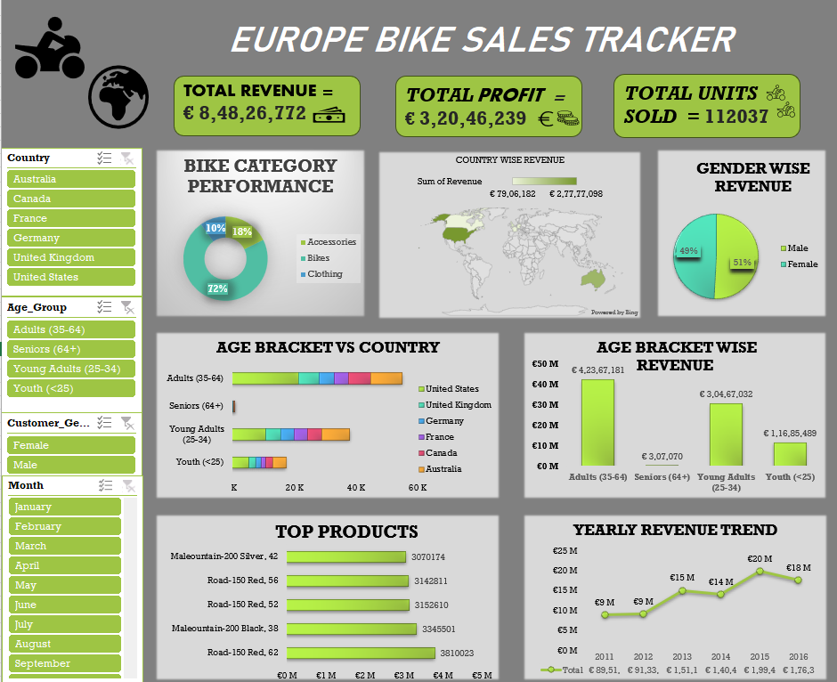

# Europe Bike Sales Dashboard

This project contains an Excel dashboard based on the Europe Bike Sales dataset.

## Contents

- *EUROPE BIKE SALES*: The Excel file with the data and dashboard.
- *DASHBOARD-SCREENSHOT.png*: A preview of the dashboard.
- *README.md*: Project overview and details.

## Tools Used

- Microsoft Excel
- Data Visualization
- Pivot Tables & Charts

## Insights

-Identified top-selling countries and their contribution to total revenue.
- Highlighted best-performing bike categories using visual comparisons.
- Analyzed revenue distribution across different age brackets and genders.
- Displayed top-selling bike models by total sales volume.
- Tracked yearly revenue trends to spot performance patterns over time.
  
## How to Use
- Download the Excel file [Europe_Bike_Sales_Dashboard.xlsx](Europe_Bike_Sales_Dashboard.xlsx).
- Open it in Microsoft Excel.
- Explore the dashboard and interact with the slicers and filters.

## Screenshot

[Click here to view the dashboard screenshot](DASHBOARD-SCREENSHOT.png)

 
---

## 🩺 Breast Cancer Analysis Dashboard

This project showcases an Excel dashboard analyzing a breast cancer dataset using:

- 🎯 Pivot Tables & Slicers for interactive filtering  
- 📊 Tumor size analysis by diagnosis (Benign vs Malignant)  
- 🧮 Summary cards for total patients, malignant, and benign cases  
- 🟪 Histogram-style bucket analysis for radius and area  
- 💖 Breast cancer awareness–themed pink layout

### 🔗 Files Included:
- [Breast_Cancer_Analysis_Dashboard.xlsx](Breast_Cancer_Analysis_Dashboard.xlsx)
- ![Breast Cancer Dashboard Screenshot https://github.com/mr212812/data-analysis-project/blob/main/breast_cancer%20dashboard%20screenshot.png

### 🛠 Tools Used:
Microsoft Excel | Pivot Tables | Charts | Slicers | Conditional Formatting

## Author
*Manvi Rana* | Aspiring Data Analyst 
